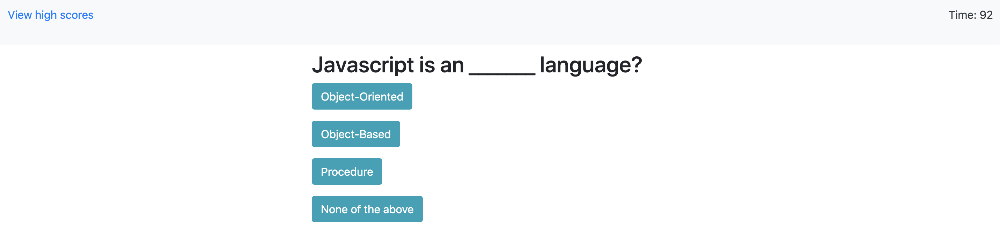
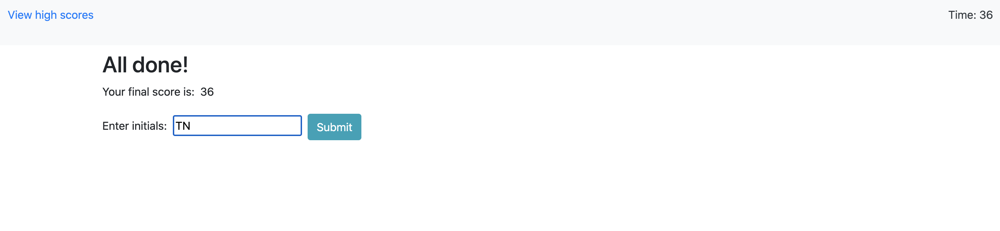
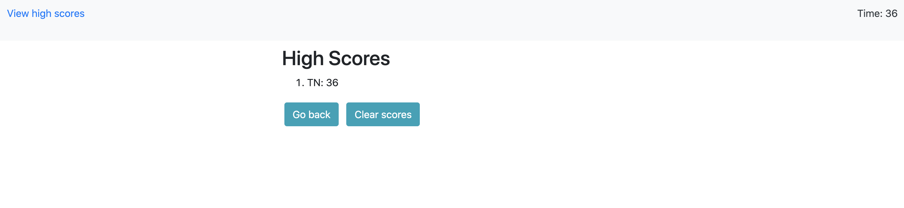

# Javascript Coding Quiz

## About
---
This is a Javascript quiz to test your knownledge about Javascript. There are 8 questions total and the application will inform the users if they got the answer correct or incorrect.]

## How it Works
---
1. Click 'Start Quiz' after you enter the application (the timer will start)
2. Read the questions and answer to your best ability
3. Once either the timer hits 0 or the quiz is completed, enter you initials and hit the save score button.
   
## Rules
---
- Users have 100 seconds to answer all 8 questions
- Each incorrect answer will lead to a decrease of 10 seconds to the user's timer
- the goal of this game is to complete the quiz with as much time left on the timer as possible

## Screenshots
---

## Links
---
Link to application here: https://triciaax.github.io/code-quiz/